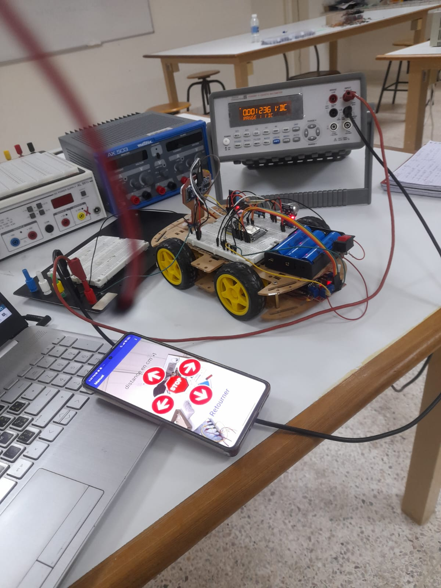

# ESP32 Smart Robot Controlled via Firebase and Android Application

## Project Overview

This project presents a **smart mobile robot based on ESP32** that can be monitored and controlled remotely using an **Android mobile application**.  
The robot integrates several sensors to monitor environmental conditions such as **temperature, humidity, and gas leakage**, and sends the collected data to a **Firebase real-time database**.

Through the mobile application, the user can interact with the robot in two different modes:

- **Manual Mode**: Direct control of the robot’s movement.
- **Automatic Mode**: Autonomous behavior based on programmed conditions and sensor data.

The system demonstrates how **IoT technologies** can be used to connect embedded systems with cloud services and mobile applications.

---

## System Architecture

The following diagram illustrates the general architecture of the project, including the ESP32 microcontroller, sensors, motors, and communication with Firebase and the mobile application.

---

## Mobile Application Interface

The mobile application was developed using **MIT App Inventor**, which allows the creation of Android applications through a visual programming environment.

### Main Interface

The first screen of the application contains three main options:

- **Mesure**: Displays real-time sensor data.
- **Manual Control**: Allows the user to move the robot in different directions.
- **Auto Mode**: Activates the autonomous navigation mode.

---

## Firebase Integration

The project uses **Firebase Realtime Database** to establish communication between the robot and the mobile application.

The ESP32 sends sensor data to Firebase, and the application reads this data to display it to the user.  
At the same time, control commands from the application are written to Firebase and read by the ESP32 to control the robot's movement.

---

## System Operation

The overall operation of the system can be summarized as follows:

1. The ESP32 reads data from the sensors.
2. Sensor data is sent to Firebase in real time.
3. The mobile application retrieves this data and displays it to the user.
4. The user can control the robot manually or activate automatic mode.
5. Commands from the application are transmitted through Firebase to the ESP32.

This architecture enables **real-time communication between hardware, cloud services, and mobile devices**.

---

## Demonstration

The following video shows the robot in operation, including:

- Sensor monitoring
- Mobile application interface
- Manual robot control
- Automatic navigation mode

🎥 **Project Demonstration Video**

[Watch the video](VIDEO_LINK_HERE)

---

## Technologies Used

- ESP32 Microcontroller  
- Arduino IDE  
- Firebase Realtime Database  
- MIT App Inventor  
- Sensors (Temperature, Humidity, Gas Detection)  
- Motor Driver and DC Motors  

---

## Author

**Hamza El Amraoui**

Master's Student – Embedded Systems / IoT  
